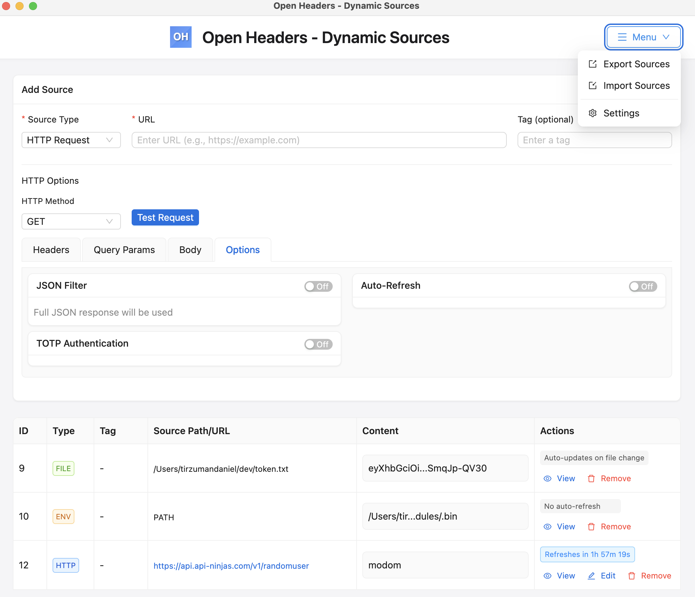
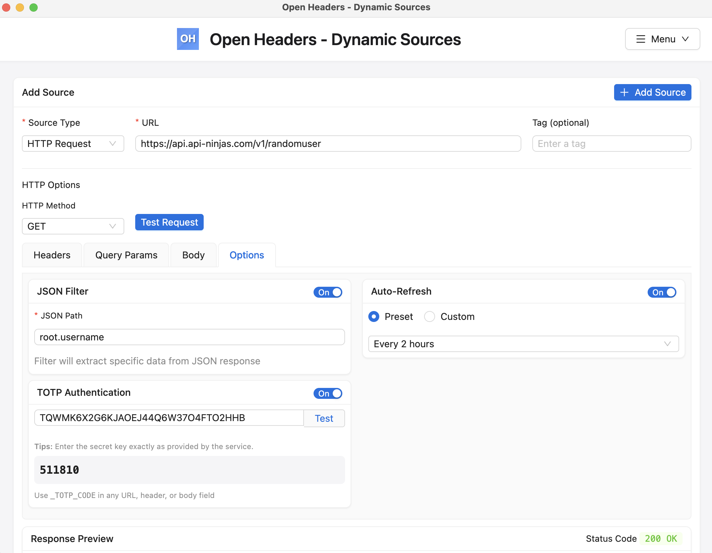
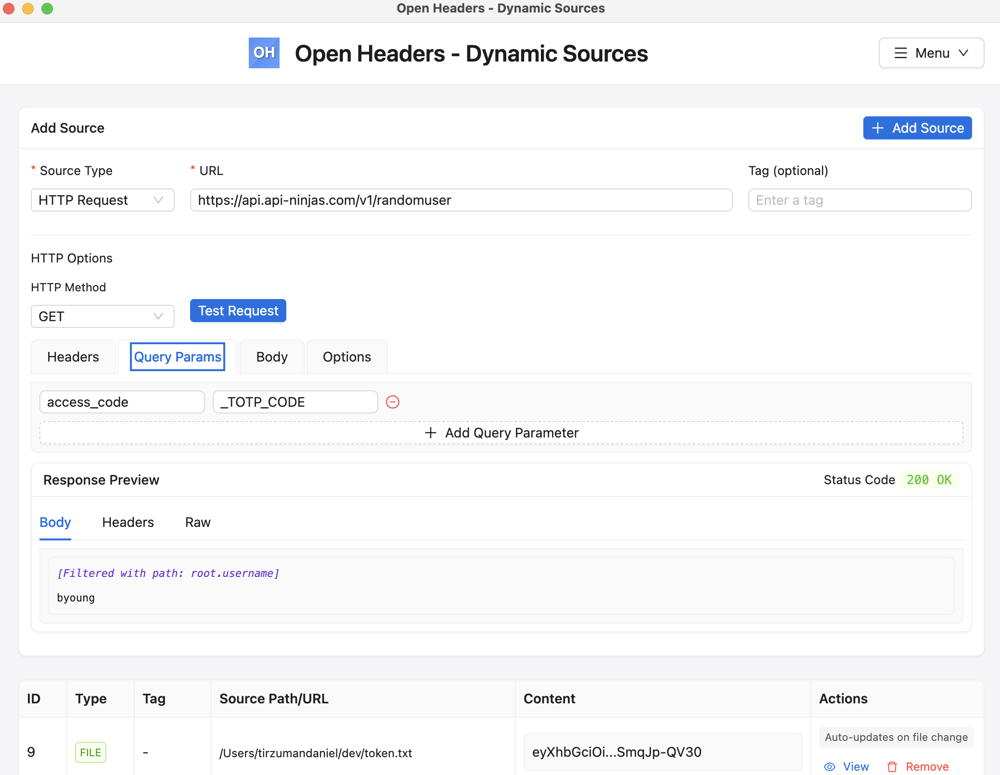
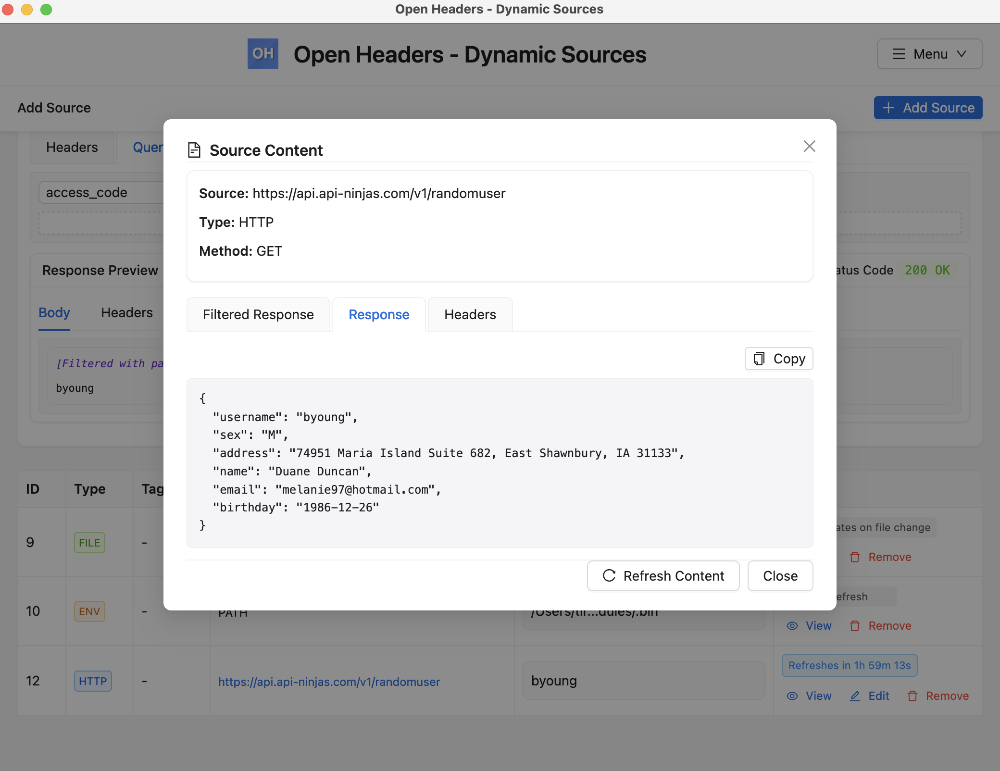
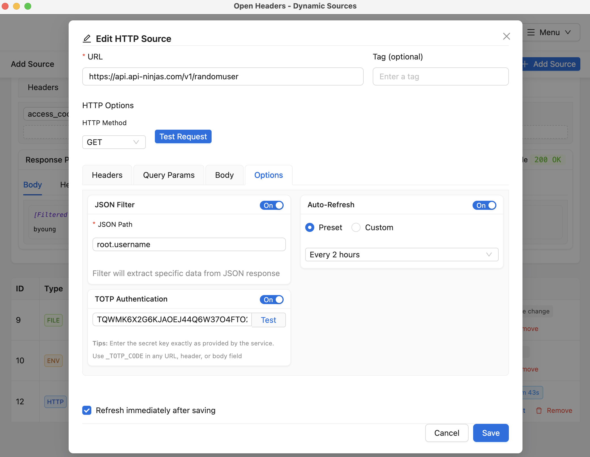
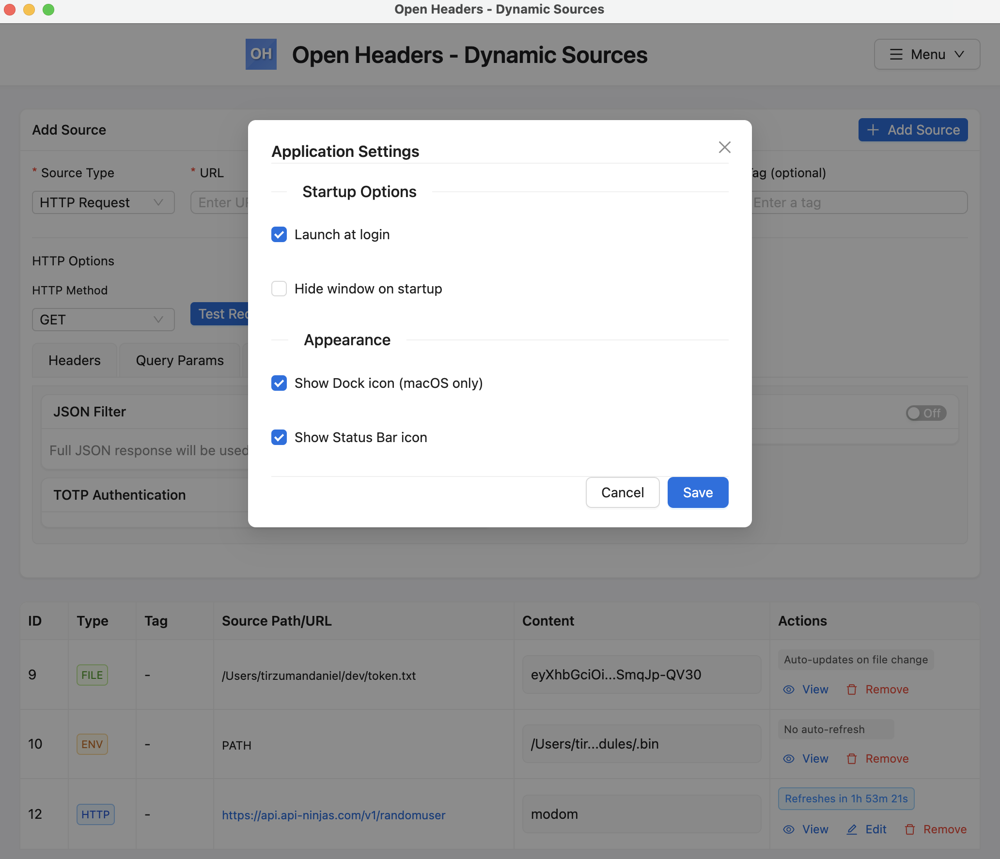
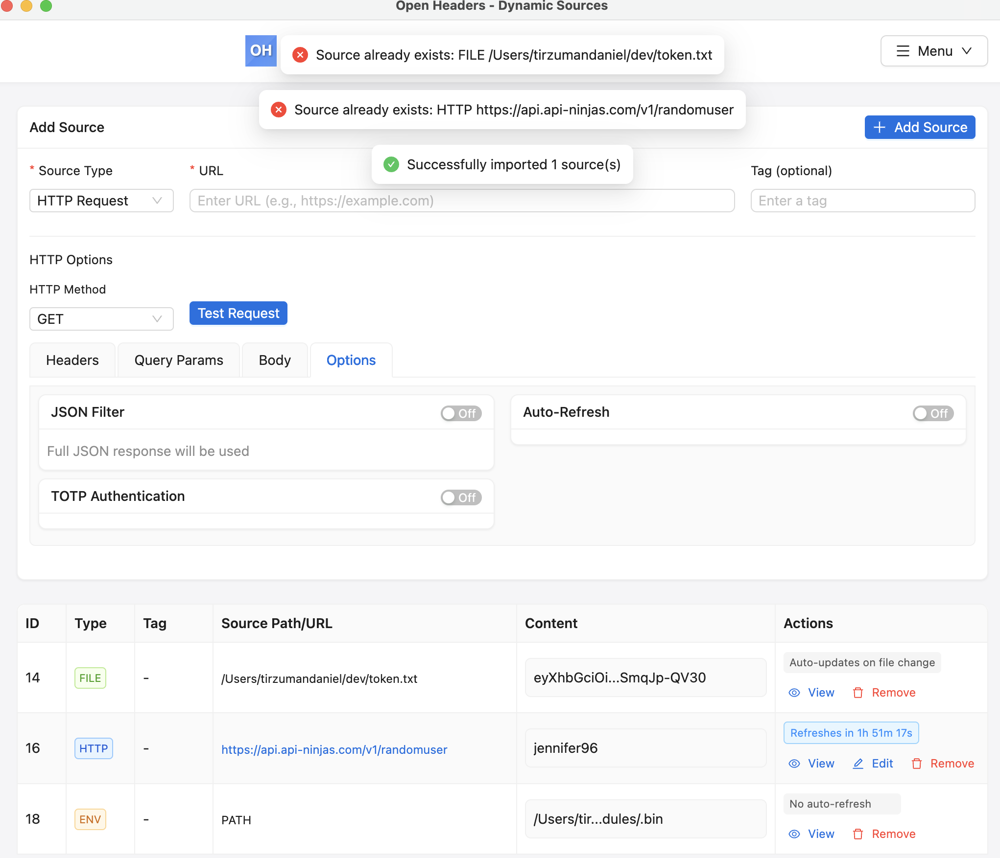

# Open Headers - Dynamic Sources


A companion application for the Open Headers browser extension that manages dynamic sources from files, environment variables, and HTTP endpoints.

## ✨ Features

- 🔄 **Multiple Source Types**: Retrieve values from HTTP requests, environment variables, and local files
- 🔍 **JSON Path Filtering**: Extract specific values from JSON responses with intuitive dot notation
- ⏱️ **Auto-Refresh**: Schedule periodic updates for HTTP sources with flexible timing options
- 🛡️ **TOTP Authentication**: Generate time-based one-time passwords for secure API access
- 📝 **HTTP Source Editing**: Modify all aspects of HTTP sources after creation
- 💾 **Import/Export**: Share source configurations between instances
- ⚙️ **App Settings**: Configure app behavior, appearance and startup options
- 🔔 **Status Bar Icon**: Access the app quickly from the system tray/menu bar
- 📱 **Dock Icon Control**: Show or hide app icon in macOS dock
- 🚀 **Auto-start**: Launch automatically at system startup
- 🙈 **Hidden Startup**: Option to start minimized to the tray
- 💻 **Modern UI**: Clean, minimalist design with Ant Design components
- 🔡 **HTTP Header Case Preservation**: Headers maintain their original capitalization for improved standards compliance
- 📦 **Rich Response Support**: Properly handle any type of HTTP response content beyond just JSON
- 🦊 **Firefox Support**: Added secure WebSocket (WSS) support for Firefox extension
- 📂 **Cross-Platform File Watching**: Improved file monitoring support across macOS, Windows, and Linux
- 📦 **Debian Package Support**: Added native Debian package (.deb) distribution for Linux systems
- 🔄 **Automatic Updates**: Built-in update system that checks for and installs new versions

## 📸 Screenshots

### Application Overview



### Additional Features

*Click on any screenshot to view full size*

| Test HTTP Request | HTTP Response Preview | View Source Content |
|:---:|:---:|:---:|
| [](./docs/screenshots/1-test-request-with-options.png) | [](./docs/screenshots/2-response-preview-filtered.png) | [](./docs/screenshots/3-view-source-content-after-adding.png) |

| Edit HTTP Source | App Settings: startup/display | Import Sources Validation |
|:---:|:---:|:---:|
| [](./docs/screenshots/4-edit-http-source-after-adding.png) | [](./docs/screenshots/5-settings-startup-display.png) | [](./docs/screenshots/6-import-sources-validation.png) |

## 📥 Installation

### 🖥️ System Requirements

- **Operating Systems**:
  - Windows 10/11 (64-bit)
  - macOS 10.15 (Catalina) or later
  - Linux with GTK3 support (Ubuntu 18.04+, Debian 10+, Fedora 32+)
- **Hardware**:
  - 100MB of disk space
  - 2GB RAM (4GB recommended)
  - 1280x720 minimum screen resolution

### 🛠️ Prebuilt Binaries

1. Download the latest release for your platform:
   - [macOS](https://github.com/OpenHeaders/open-headers-app/releases)
   - [Windows](https://github.com/OpenHeaders/open-headers-app/releases)
   - [Linux](https://github.com/OpenHeaders/open-headers-app/releases)

2. Install the application:
   - **macOS**: Open the DMG file and drag the app to your Applications folder
   - **Windows**: Run the installer executable
   - **Linux**: Install the Debian package (.deb) or extract the AppImage and make it executable

### 🧑‍💻 Building from Source

1. Clone the repository:
   ```bash
   git clone https://github.com/OpenHeaders/open-headers-app.git
   cd open-headers-app
   ```

2. Install dependencies:
   ```bash
   npm install
   ```

3. Run in development mode:
   ```bash
   npm run dev:react
   ```

4. Build for your platform:
   ```bash
   npm run dist
   ```

5. The built application will be in the `dist` directory

For more detailed build options, see the [DEVELOPER.md](./docs/DEVELOPER.md) document.

## 🔄 CI/CD and Release Process

The Open Headers application uses GitHub Actions for continuous integration and deployment:

### 🚀 Automated Builds

All pushes to the main branch and pull requests are automatically built on:
- macOS (both Intel and Apple Silicon)
- Windows
- Linux (x64 and ARM64)

### 📦 Release Automation

When a new tag is pushed (starting with 'v', e.g., v2.4.24):
1. Applications are built for all supported platforms
2. macOS builds are automatically notarized with Apple when proper secrets are configured
3. A GitHub release is created with all artifacts
4. Release notes are automatically generated

### 🔐 Code Signing

- **macOS**: Builds are signed and notarized with Apple when the proper certificates are configured
- **Windows**: Can be signed when proper certificates are available

For more details on the CI/CD and release process, see the [DEVELOPER.md](./docs/DEVELOPER.md) document.

## 📋 Usage

### 🚀 Starting the Application

1. Launch the "Open Headers - Sources" application
2. The app will start in your system tray/menu bar (and optionally in the dock)
3. Click the tray icon to open the sources dashboard

### ⚙️ Configuration Settings

Access app settings by clicking the menu button in the top-right corner:

#### 🔄 Startup Options
- **Launch at login**: Start the app automatically when your system boots
- **Hide window on startup**: Start minimized to the system tray

#### 🎨 Appearance
- **Show Dock icon** (macOS): Choose whether to show the app in the dock
- **Show tray icon**: Choose whether to show the app in the system tray/menu bar

### 📁 Adding a File Source

1. From the dashboard, select "File" as the source type
2. Click "Browse" to select a local file
3. Add an optional tag for easy identification
4. Click "Add Source"

The file content will be continuously monitored for changes on all platforms.

### 🔧 Adding an Environment Variable Source

1. Select "Environment Variable" as the source type
2. Enter the name of the environment variable
3. Add an optional tag for easy identification
4. Click "Add Source"

### 🌐 Adding an HTTP Source

1. Select "HTTP Request" as the source type
2. Enter the URL for the request
3. Click on the tabs to configure different aspects of the request:
   - **Headers**: Add custom HTTP headers
   - **Query Params**: Add URL query parameters
   - **Body**: Add request body with JSON or form-urlencoded content
   - **Options**: Configure advanced features like JSON filtering, TOTP, and auto-refresh

#### 📝 Headers Configuration
1. Click the "Headers" tab
2. Click "Add Header" to add a new header
3. Enter the header name and value
4. Repeat for additional headers

#### 📊 Query Parameters
1. Click the "Query Params" tab
2. Click "Add Query Parameter" to add a new parameter
3. Enter the parameter name and value
4. Repeat for additional parameters

#### 📄 Request Body
1. Click the "Body" tab
2. Select the content type (JSON or Form URL Encoded)
3. Enter the body content in the text area

#### ⚙️ Advanced Options
1. Click the "Options" tab to access:
   - **JSON Filter**: Extract specific values from JSON responses
   - **TOTP Authentication**: Generate time-based codes for API access
   - **Auto-Refresh**: Schedule periodic updates

#### 🧪 Testing HTTP Requests
1. After configuring your request, click "Test Request"
2. The response will be displayed in the "Response Preview" section
3. You can view the body, headers, and raw response in separate tabs

### ✏️ Editing HTTP Sources

After creating an HTTP source, you can edit its configuration at any time:

1. In the sources table, find the HTTP source you want to edit
2. Click the "Edit" button in the Actions column
3. Modify any of the source properties:
   - URL and HTTP method
   - Request headers and query parameters
   - Request body content and format
   - JSON filtering options
   - TOTP authentication settings
   - Auto-refresh configuration
4. Choose whether to refresh the source immediately after saving
5. Click "Save" to apply your changes

The edit interface provides full access to all HTTP source features and preserves your configuration even when toggling options on and off. Field values remain available until you cancel the edit operation.

### 🔍 Using JSON Filtering

JSON filtering allows you to extract specific values from JSON responses:

1. Enable the "JSON Filter" toggle in the Options tab
2. Enter a JSON path using dot notation:
   - Start with `root` to reference the root object
   - Use dots to access nested properties (e.g., `root.data.user.name`)
   - Use brackets with indices for arrays (e.g., `root.items[0].id`)
3. Click "Test Request" to preview the filtered result
4. After adding the source, the JSON filter will be applied to all responses

#### 📌 JSON Path Examples:
- `root.data.token` - Extracts the token property from the data object
- `root.results[0].id` - Extracts the id from the first item in the results array
- `root.user.addresses[2].street` - Extracts the street from the third address in the user's addresses

### 🔐 Using TOTP Authentication

For APIs requiring time-based one-time passwords:

1. Enable the "TOTP Authentication" toggle in the Options tab
2. Enter your TOTP secret key (base32 encoded)
3. Click "Test" to verify the TOTP code generation
4. Use `_TOTP_CODE` placeholder in any part of your request:
   - In URL: `https://api.example.com/verify?code=_TOTP_CODE`
   - In headers: `Authorization: Bearer _TOTP_CODE`
   - In body: `{"verification_code": "_TOTP_CODE"}`

The application will automatically generate and insert the current TOTP code whenever the request is made.

### ⏰ Setting Up Auto-Refresh

To automatically update HTTP sources at regular intervals:

1. Enable the "Auto-Refresh" toggle in the Options tab
2. Choose a refresh method:
   - **Preset**: Select from predefined intervals (1 min to 24 hours)
   - **Custom**: Enter a specific interval in minutes
3. Click "Add Source" to create the source with auto-refresh enabled

The source will be refreshed automatically according to the specified interval. You can view the next refresh time in the source list.

### 📊 Viewing Source Content

To view the content of any source:

1. In the sources table, click the "View" button for the source
2. For HTTP sources, you can see:
   - Filtered Response (if JSON filtering is enabled)
   - Original Response
   - HTTP Headers
3. For file and environment variable sources, you'll see the raw content

### 💾 Importing and Exporting Sources

Easily save and share your source configurations:

#### 📤 Exporting Sources
1. Click the menu button in the top-right corner
2. Select "Export Sources"
3. Choose a location to save the JSON file
4. All source configurations will be saved to the file

#### 📥 Importing Sources
1. Click the menu button in the top-right corner
2. Select "Import Sources"
3. Select a previously exported JSON file
4. The sources will be loaded and added to your existing sources

The application will detect duplicate sources during import and only add new ones.

### 🔽 Minimizing to Tray

- When the application window is closed, it will minimize to the system tray rather than quitting
- Click the tray icon to restore the window
- Right-click the tray icon for additional options (Show Open Headers, Hide Open Headers, Quit)

### 🔄 Automatic Updates

The application includes a built-in update system that:

1. Automatically checks for new versions on startup
2. Performs periodic update checks every 6 hours
3. Notifies you when updates are available
4. Downloads updates in the background
5. Shows download progress
6. Prompts you to install when ready

To manually check for updates:
1. Click the menu button in the top-right corner
2. Select "Check for Updates"

## 🔄 Connecting to the Browser Extension

1. Install the Open Headers browser extension:
   - 🌐 **[Google Chrome](https://chromewebstore.google.com/detail/ablaikadpbfblkmhpmbbnbbfjoibeejb?utm_source=item-share-cb)**
   - 🔷 **[Microsoft Edge](https://microsoftedge.microsoft.com/addons/detail/open-headers/gnbibobkkddlflknjkgcmokdlpddegpo)**
   - 🦊 **[Mozilla Firefox](https://addons.mozilla.org/en-US/firefox/addon/open-headers/)**
   - **🐙 Build it yourself from [Github](https://github.com/OpenHeaders/open-headers-browser-extension)**
2. Launch the Dynamic Sources application
3. The extension will automatically connect to the application:
   - Chrome/Edge use standard WebSocket (WS) on port 59210
   - Firefox uses secure WebSocket (WSS) on port 59211
4. In the extension popup, your dynamic sources will appear as options when creating headers

The application automatically generates and manages self-signed certificates for the secure WebSocket connection used by Firefox.

## ❓ Troubleshooting

### 🔄 Update Issues

If automatic updates aren't working:

1. Check your internet connection
2. Ensure you have write permissions to the application directory
3. Try manually downloading the latest version
4. Check the log file at:
   - **macOS**: `~/Library/Logs/OpenHeaders/main.log`
   - **Windows**: `%USERPROFILE%\AppData\Roaming\OpenHeaders\logs\main.log`
   - **Linux**: `~/.config/OpenHeaders/logs/main.log`

### 🔌 Extension Connection Problems

If the browser extension can't connect:

1. Ensure the Open Headers app is running
2. Check if any firewall is blocking localhost connections on ports 59210/59211
3. For Firefox, you may need to accept the self-signed certificate by visiting:
   - https://localhost:59211/verify-cert

### 📁 File Watching Not Working

If file source updates aren't detected:

1. Ensure you have read permissions for the file
2. Try using an absolute file path instead of a relative path
3. Some network drives may not support file watching - copy to a local drive instead

### 🐞 Common Errors

- **"Failed to connect to WebSocket server"**: Ensure the app is running and no other application is using ports 59210/59211
- **"Failed to update source"**: Check your internet connection or API endpoint
- **"Failed to generate TOTP code"**: Verify your TOTP secret is correct and properly formatted
- **"JSON filter path not found"**: Check that your JSON path matches the actual response structure

## 📚 Documentation

For more detailed information, see:
- [DEVELOPER.md](./docs/DEVELOPER.md) - Technical documentation for developers
- [CONTRIBUTING.md](./docs/CONTRIBUTING.md) - Guidelines for contributing to the project

## 👥 Contributing

Contributions are welcome! Please refer to [CONTRIBUTING.md](./docs/CONTRIBUTING.md) for guidelines.

## 📄 License

This project is licensed under the MIT License - see the LICENSE file for details.